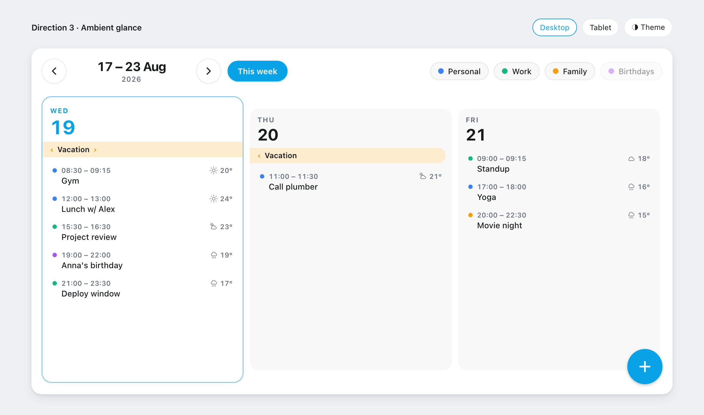
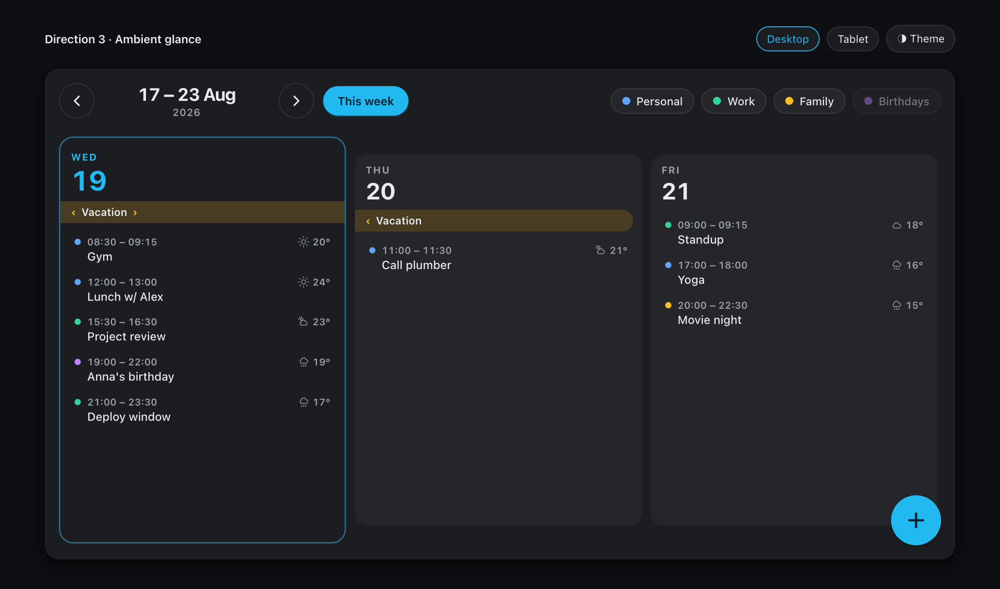

# Calendar Week View

A Home Assistant Lovelace card that renders the **current week** as a horizontal
strip of day-columns: a highlighted **today**, per-event **start–end times** and
**hourly weather**, all-day / multi-day pills with continuation chevrons, a
calendar legend, floating carousel arrows, and a floating **quick-add** button.
A status header carries a bold **live clock**, today's **date**, and the **next
upcoming event** with a live countdown; a **return-to-today** glyph appears
only when today has scrolled off-screen and points the way back.




Derived from [week-planner-card](https://github.com/FamousWolf/week-planner-card)
by Rudy Gnodde (MIT) — the calendar data layer is reused; the UI, navigation, and
configuration surface are new.

## Installation

### HACS (recommended)

This card is not in the default HACS store yet, so add it as a **custom repository**:

1. In Home Assistant, open **HACS**.
2. Top-right menu (⋮) → **Custom repositories**.
3. Paste `https://github.com/mswiszcz/calendar-week-view`, choose type **Dashboard**, and click **Add**.
4. Search HACS for **Calendar Week View** and click **Download** (installs the latest release).
5. HACS registers the dashboard resource automatically. If it does not, add it under
   **Settings → Dashboards → ⋮ → Resources → Add resource**:
   - URL: `/hacsfiles/calendar-week-view/calendar-week-view.js`
   - Resource type: **JavaScript Module**
6. Hard-refresh the browser, then add the card (see [Usage](#usage)).

[](https://my.home-assistant.io/redirect/hacs_repository/?owner=mswiszcz&repository=calendar-week-view&category=dashboard)

### Manual

1. Download `calendar-week-view.js` from the
   [latest release](https://github.com/mswiszcz/calendar-week-view/releases/latest).
2. Copy it into `config/www/` on your Home Assistant instance.
3. **Settings → Dashboards → ⋮ → Resources → Add resource**:
   - URL: `/local/calendar-week-view.js`
   - Resource type: **JavaScript Module**
4. Hard-refresh the browser.

## Usage

Add the card via the dashboard **visual card picker** ("Calendar Week View").
The card ships a full **visual editor** — add, configure, and remove calendars,
pick a weather entity, choose UI colors, and set every option without touching
YAML. You can still configure it in YAML if you prefer:

```yaml
type: custom:calendar-week-view
title: This week
weekStartsOn: monday
visibleDays: 3
addEvents: true
weather:
  entity: weather.home
calendars:
  - entity: calendar.personal
    name: Personal
    color: '#3b82f6'
  - entity: calendar.work
    name: Work
    color: '#10b981'
```

## Configuration

| Option | Type | Default | Description |
|---|---|---|---|
| `type` | string | — | `custom:calendar-week-view` (required). |
| `title` | string | — | Optional heading shown above the week strip. |
| `calendars` | list | — | Required, at least one. See [Calendar options](#calendar-options). |
| `weekStartsOn` | `monday` \| `sunday` | `monday` | First day of the week. |
| `viewMode` | `agenda` \| `calendar` | `agenda` | Agenda lists events per day; calendar spans them over an hour grid. |
| `orientation` | `horizontal` \| `vertical` | `horizontal` | Agenda layout axis. Horizontal is the scrolling day strip; vertical stacks days full-width, each at its full height, and grows the card to fit (the dashboard scrolls, not the card). Ignored in calendar view. |
| `startHour` | number | `8` | Calendar view: the hour (0–23) the grid initially scrolls to. |
| `visibleDays` | number | `3` | Horizontal: columns visible at once; the strip scrolls to reveal the rest. Vertical and `lockToday`: the number of days shown from today. |
| `hideWeekend` | boolean | `false` | Show Monday–Friday only (5 columns). |
| `lockToday` | boolean | `false` | Pin the view to today: navigation off, showing `visibleDays` days from today (`1` → today only). |
| `highlightToday` | boolean | `true` | Tint today's column background. |
| `todayBorder` | boolean | `true` | Draw today's accent outline. |
| `todayText` | boolean | `true` | Accent today's date (color + larger number). Off makes it read like any other day. |
| `height` | string | `520px` | **Minimum** height. The card fills its container (full height in a panel view) and never shrinks below this. |
| `showNavigation` | boolean | `true` | Show the floating carousel arrows and the **return-to-today** glyph. The strip pages by one view and rolls into adjacent weeks; swipe still works. Forced off by `lockToday`. |
| `showLegend` | boolean | `true` | Show the calendar legend chips. |
| `legendToggle` | boolean | `true` | Click a legend chip to hide/show that calendar's events. |
| `showClock` | boolean | `true` | Show the live clock and date in the status header. |
| `showNextEvent` | boolean | `true` | Show the next upcoming event with a live countdown in the status header. |
| `addEvents` | boolean | `false` | Show the floating quick-add button (needs ≥1 writable calendar). It writes to all writable configured calendars. |
| `headerButtons` | array | — | Custom buttons at the top-right of the header. See [Custom buttons](#custom-buttons). |
| `floatingButtons` | array | — | Custom buttons beside the floating **+** at the bottom-right. See [Custom buttons](#custom-buttons). |
| `weather` | object | — | Optional hourly weather. See [Weather options](#weather-options). |
| `colors` | object | — | Override UI colors. See [Color options](#color-options). |
| `combineSimilarEvents` | boolean | `false` | Merge identical events that appear in more than one calendar. |
| `updateInterval` | number | `60` | Seconds between background re-fetches. |
| `compact` | boolean | `false` | Tighter padding and shorter columns. |
| `noCardBackground` | boolean | `false` | Render without the card background and shadow. |
| `timeFormat` | string | `HH:mm` | [Luxon](https://moment.github.io/luxon/#/formatting) token for event times. |
| `dateFormat` | string | `yyyy · LLLL · cccc` | [Luxon](https://moment.github.io/luxon/#/formatting) token for the meta line above each day number (e.g. `2026 · August · Saturday`). |
| `clockFormat` | string | `HH:mm` | [Luxon](https://moment.github.io/luxon/#/formatting) token for the header clock. Include seconds (e.g. `HH:mm:ss`) to make it tick every second. |
| `headerDateFormat` | string | `cccc, d LLLL` | [Luxon](https://moment.github.io/luxon/#/formatting) token for the date beside the clock (e.g. `Wednesday, 19 August`). |
| `locale` | string | browser | BCP-47 locale (e.g. `en`, `de`, `fr`) applied to formatted dates and times. |
| `texts` | object | — | String overrides. Currently: `noEvents` (empty-day text), `today` (return-to-today button label). |

### Calendar options

| Option | Type | Default | Description |
|---|---|---|---|
| `entity` | string | — | Calendar entity id (required). |
| `name` | string | entity id | Display name in the legend and dialogs. |
| `color` | CSS color | `var(--primary-color)` | Dot / pill color for this calendar. |
| `filter` | regex string | — | Exclude events whose summary matches the pattern. |
| `hideInLegend` | boolean | `false` | Keep the calendar's events but omit it from the legend. |
| `initiallyHidden` | boolean | `false` | Start with this calendar's events hidden. |

### Weather options

| Option | Type | Default | Description |
|---|---|---|---|
| `entity` | string | — | A `weather.*` entity that provides an hourly forecast (required). |
| `showTemperature` | boolean | `true` | Show the temperature next to the icon. |
| `roundTemperature` | boolean | `true` | Round the temperature to a whole number. |

Weather is shown per **timed** event, at the event's start hour, using native
`mdi:weather-*` icons (no bundled image assets).

> **Weather horizon.** Hourly forecasts typically extend only ~24–48 hours (a
> few days for some integrations). Events beyond that horizon — as well as
> all-day and past events — show **no** weather rather than a blank icon. This is
> expected, not a bug.

### Color options

All optional; each overrides one UI element and falls back to the active Home
Assistant theme when unset. Accepts any CSS color (hex, named, or `var(--token)`).

```yaml
colors:
  accent: '#0aa2e6'        # today accent, quick-add button, return-to-today button, countdown
  today: '#e8f4fd'         # today column background
  dayBackground: '#f5f5f7' # day column + legend chip background
  cardBackground: '#ffffff'
  text: '#1a1c1e'
  secondaryText: '#5f6368'
```

| Key | Overrides |
|---|---|
| `accent` | Today accent, quick-add FAB, return-to-today button, next-event countdown, arrow hover. |
| `today` | Today column background tint. |
| `dayBackground` | Day column and legend chip background. |
| `cardBackground` | Card and pill background base. |
| `text` | Primary text. |
| `secondaryText` | Day names, event times, subtitles. |

## Layout & views

- **View mode** (`viewMode`): `agenda` lists each day's events; `calendar` spans timed
  events over an hour grid that scrolls to `startHour` and shows a live now-line.
- **Orientation** (`orientation`, agenda only): `horizontal` is the scrolling day strip;
  `vertical` stacks `visibleDays` days from today full-width, each at the full height its
  events need with no inner scroll, and grows the card to fit the list — the dashboard
  scrolls, nothing inside the card does, so there is no paging. A natural fit for a
  scrollable agenda column. Calendar view keeps its horizontal time-grid regardless.
- **Lock to today** (`lockToday`): pins the card to today, turns navigation off, and shows
  `visibleDays` days starting at today (`1` → today only). The header, weather, and
  quick-add still work; the carousel window and paging are simply not built.

## Status header

The top-left of the card carries a bold live **clock** with today's **date**
(`showClock`, default on) and the **next upcoming event** with a countdown
(`in 30m`, `in 2h 15m`, `in 3d`) (`showNextEvent`, default on). The two are
independent — show either, both, or neither. The clock ticks on its natural
boundary — every minute, or every second if `clockFormat` includes seconds.

The next-event picker prefers the nearest **timed** event and skips all-day
events, with one exception: once no timed events remain **today**, an all-day
event starting **tomorrow** is surfaced (shown as `Tomorrow`) — the natural
"what's next" when the day is done. The clock/date/next-event always reflect
**now**, independent of how far the strip is scrolled.

The **return-to-today** glyph (part of `showNavigation`) appears only when today
has scrolled out of view; its arrow points toward today, and clicking it jumps
straight back — from any distance, not just the current week.

## Custom buttons

Two optional lists add your own buttons, each firing a standard Home Assistant
action (`navigate`, `url`, `call-service`, `more-info`, `toggle`):

- **`headerButtons`** render at the **top-right** of the header, vertically
  centered, as pill chips (icon plus optional label).
- **`floatingButtons`** render as round icon buttons **to the left of the
  floating +** at the bottom-right. They work with or without `addEvents`.

```yaml
headerButtons:
  - icon: mdi:cog
    name: Settings
    tap_action:
      action: navigate
      navigation_path: /config
  - icon: mdi:web
    tap_action:
      action: url
      url_path: https://home-assistant.io
floatingButtons:
  - icon: mdi:lightbulb
    name: Toggle lamp
    color: '#f5a623'
    tap_action:
      action: call-service
      service: light.toggle
      target:
        entity_id: light.living_room
```

| Field | Type | Description |
|---|---|---|
| `icon` | string | MDI icon (e.g. `mdi:cog`). Required. |
| `name` | string | Header: shown as the button label. Floating: used as the tooltip. |
| `color` | CSS color | Optional accent for the button's icon (and header chip). |
| `tap_action` | object | A Home Assistant [action](https://www.home-assistant.io/dashboards/actions/). A button without one renders but does nothing. |

## Managing events

Click any event to open its overview. When the event's calendar supports it
(`local_calendar`, CalDAV, most Google setups), the overview offers **Edit** and
**Delete**. Recurring events ask whether the change applies to **this event**,
**this and following events**, or **all events**, matching Home Assistant's own
calendar. Use the floating **+** button (enable `addEvents`) to create events.

### Reserved (not yet implemented)

These keys are accepted by the config schema but currently have no effect:
per-calendar `filterText` / `icon`.

## Development

```bash
pnpm install
pnpm test        # vitest — pure week/weather logic
pnpm typecheck   # tsc --noEmit
pnpm lint        # oxlint
pnpm build       # esbuild → dist/calendar-week-view.js
pnpm watch       # rebuild on change
```

### Releasing

Bump `version` in `package.json`, commit on a feature branch, then:

```bash
make push        # verify → push branch → PR → merge to main → tag vX.Y.Z → push tag
```

Pushing the tag triggers `release.yml`, which builds and attaches
`dist/calendar-week-view.js` to the GitHub release. `make verify` runs the
test / typecheck / lint / build gate on its own.

Pure, timezone- and now-injected logic lives in `src/week.ts` and
`src/weather.ts` (unit-tested); `src/card.ts` is the Lit shell that does all
`hass` I/O and rendering.

## License & attribution

MIT. Built on the data layer of
[week-planner-card](https://github.com/FamousWolf/week-planner-card) by Rudy
Gnodde (MIT); this project retains the upstream copyright notice and adds its
own. See [`LICENSE`](LICENSE).
